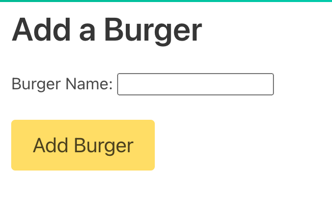
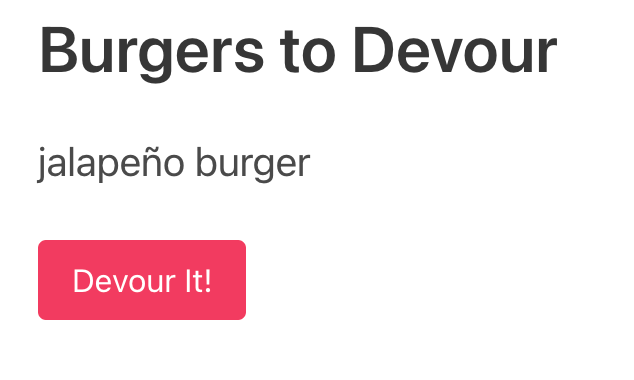
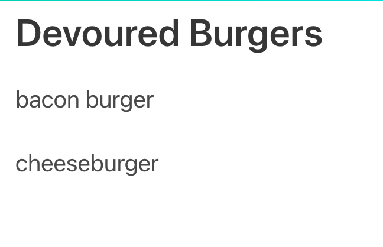

# Eat-Da-Burger!    
  

  ## Table of Contents  
  1. [Description](#description) 
  2. [Installation](#installation) 
  3. [Usage](#usage)
  4. [Licensing](#licensing)
  5. [Additional Questions](#additional-questions?)

  ---  

  ## Description:  
  For this homework assignment, we had to complete a hosted web-app using the MVC concept. To implement, I had to utilie the mysql, express, and express handlebars npms. The app's functionality must all users to add a new type of burger. When a new burger is created, the burger defaults to the left side of the screen, which is a list of burgers that have not been eaten. Each burger in this section also has a button that allows the user to indicate that the burger has been devoured. Once they click this button the burger is then moved to the right side of the page which contains the list of devoured burgers.  

  ---  

  ## Installation:  
  No installation necessary! Simply visit the following URL to use this app: https://polar-forest-74613.herokuapp.com/  

  ---  

  ## Usage:  
  To get started, first enter the name of a burger you would like to eat. Then click 'Add Burger.'
  
  
  
  After this, you'll see the newly added burger appear on the left side of the screen. To "eat" this burger, click the red 'Devour It!' button underneath the burger you'd like to eat. 
  
  
  
  You will then see that your burger has been moved to the right side of the page.  

  

  --- 

  ## Licensing:  
  Public Domain - App can be shared and modified however you want!

  ---  

  ## Additional Questions?  
  If you have any other questions, you can contact the project creator at:  
  GitHub username: rhubble1987  
  Email address: rhubble1987@gmail.com
